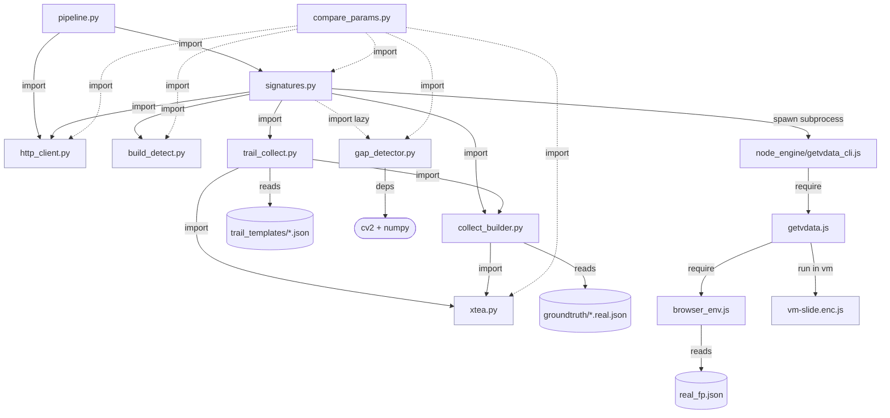

# browserless_pipeline — full-chain urlsec.qq.com URL-safety checker

> 🌐 [中文版本](README.zh-CN.md)

One orchestrator that runs the entire urlsec.qq.com check flow for a URL and returns
the safety verdict:

```
prehandle → show (nonce/sess/image/tdc.js) → hycdn images → CV ans
          → tdc.js build-detect → collect (XTEA) → verify → gw_check → VERDICT
```

```bash
python3 -m browserless_pipeline.pipeline <url> [--provider browser|browserless]
# e.g.
python3 -m browserless_pipeline.pipeline 4444.vip --provider browser
```

```python
from browserless_pipeline import check_url
verdict = check_url("4444.vip", provider="browser")
```

## Standalone — pack & run anywhere

This folder is **self-contained**: drop it next to your code, `import`, and run. It
has no dependency on the surrounding repo (the CV detector and the collect templates
are vendored in `gap_detector.py` / `groundtruth/`).

```bash
# 1. dependencies
pip install -r browserless_pipeline/requirements.txt   # opencv-python-headless, numpy
#    plus Node.js on PATH (for node_engine/getvdata_cli.js — the vData VM)

# 2. run (browserless needs no Chrome)
python3 -m browserless_pipeline.pipeline huawei.com --provider browserless
```

To ship it elsewhere: `tar -czf bl.tgz --exclude=__pycache__ browserless_pipeline`,
unpack at the destination, `pip install -r .../requirements.txt`, done. The `browser`
provider additionally needs the Kimi WebBridge daemon + Chrome; `browserless` does not.

Verified: copied to an empty dir with no repo siblings → self-tests pass (HAR/tdc.js
fixture tests skip gracefully) and a live `huawei.com` check returns `eviltype 0 SAFE`.

## Architecture — files ↔ pipeline

How a URL flows through the code (browserless path). Each box names the file/function
that owns the step; the four captcha signatures are built in the middle band and
merged at `verify`.

```
 check_url(url)                                                        pipeline.py
      │
      ▼
 BrowserlessSolver.solve → _attempt()  (retry loop until errorCode 0) signatures.py
      │
      ├─►(1) prehandle ─────────────────────► sess, sid               http_client.py
      ├─►(2) show ──────────► nonce, sess', image_id, dc_file, vlg     http_client.py
      ├─►(3) fetch_image ×2 ─► bg + slider PNG bytes                   http_client.py
      ├─►(4) detect_gap_multiscale(bg,sl) ─► gap_x,gap_y,conf  ══╗     gap_detector.py (vendored)
      ├─►(5) fetch_tdc_js ─► tdc.js                              ║     http_client.py
      │        │                                                 ║
      │        ├─ detect_build ─► build (tdc1–10)                ║     build_detect.py
      │        └─ extract_eks  ─► eks ═══════════════════════╗   ║     build_detect.py
      │                                                      ║   ║
      ├─►(6) collect ─┐  trail template exists? (tdc2–10)    ║   ║
      │       ┌───────┴──── yes ─► trail_collect.build_collect_with_trail
      │       │                       └─ trail_templates/<build>.json + xtea.py
      │       └──────────── no (tdc1) ─► collect_builder.build_collect
      │                               └─ groundtruth/<build>.real.json + xtea.py
      │                        collect (RAW base64), tlg, ans ═╗ ║   ║
      │                                                        ║ ║   ║
      ├─►(7) vData  ── subprocess ─► node_engine/getvdata_cli.js
      │            getvdata.js → vm-slide.enc.js (Chaos VM)    ║ ║   ║
      │            + browser_env.js + real_fp.json             ║ ║   ║
      │                                    vData ══════════════╣ ║   ║
      │                                                        ▼ ▼   ▼
      └─►(8) verify(POST cap_union_new_verify) ◄── {ans, collect+tlg, eks, vData, vlg}
               _post_form() = single URL-encode of the wire         http_client.py
                    │
                    ▼  errorCode 0 → ticket, randstr   (9/12 → retry from step 1)
 ───────────────────────────────────────────────────────────────────
 gw_check(url, ticket, randstr) ─► VERDICT dict (eviltype, wording…)  http_client.py
```



```mermaid
flowchart TD
    CLI["pipeline.py<br/>check_url(url)"] --> SOLVE["signatures.py<br/>BrowserlessSolver._attempt() — retry loop"]

    subgraph HTTP["http_client.py — HTTP stages"]
        PRE["prehandle → sess,sid"]
        SHOW["show → nonce,sess',image_id,dc_file,vlg"]
        IMG["fetch_image ×2 → bg, slider"]
        TDC["fetch_tdc_js → tdc.js"]
        VERIFY["verify (POST) — _post_form single-encodes"]
        GW["gw_check → VERDICT"]
    end

    SOLVE --> PRE --> SHOW --> IMG --> TDC

    IMG --> CV["gap_detector.py (vendored)<br/>detect_gap_multiscale"]
    CV --> ANS(["ans = gap_x,gap_y"])

    TDC --> BD["build_detect.py<br/>detect_build + extract_eks"]
    BD --> BUILD(["build tdc1–10"])
    BD --> EKS(["eks"])

    BUILD -->|tdc2–10| TRAIL["trail_collect.py<br/>build_collect_with_trail"]
    BUILD -->|tdc1 / fallback| CB["collect_builder.py<br/>build_collect"]
    TT[("trail_templates/*.json")] --> TRAIL
    GT[("groundtruth/*.real.json")] --> CB
    XTEA["xtea.py — XTEA-ECB + keys"] --> TRAIL
    XTEA --> CB
    TRAIL --> COLLECT(["collect RAW base64 + tlg"])
    CB --> COLLECT

    SOLVE --> VD["node_engine/getvdata_cli.js<br/>→ getvdata.js → vm-slide.enc.js<br/>+ browser_env.js + real_fp.json"]
    VD --> VDATA(["vData"])

    ANS --> VERIFY
    EKS --> VERIFY
    COLLECT --> VERIFY
    VDATA --> VERIFY
    VERIFY -->|errorCode 0: ticket,randstr| GW
    VERIFY -.->|9/12: retry| SOLVE
    GW --> OUT([URL safety verdict])

    DIAG["compare_params.py<br/>(diagnostic — off path)"] -.diffs wire of.-> VERIFY
```

### Module dependency graph (who imports / calls whom)

The data-flow above is *what happens when*; this is *which file depends on which*.
Solid = Python `import`; `reads` = loads a data file; `spawns` = Node subprocess.

```
                         pipeline.py            (entry / CLI)
                          │  imports
                  ┌───────┴───────┐
                  ▼               ▼
            signatures.py      http_client.py   (stdlib only — no internal deps)
                  │ imports
   ┌──────┬───────┼───────────┬──────────────┐
   ▼      ▼       ▼           ▼              ▼ (lazy)
http_   build_  collect_    trail_         gap_detector.py
client  detect  builder ◄── collect         (cv2, numpy)
.py     .py     .py    imports  .py
                  │              │
                  │ imports      │ imports
                  └──────┬───────┘
                         ▼
                       xtea.py        (cipher + 10 keys — leaf)

  signatures.py ── spawns ─► node_engine/getvdata_cli.js
                                  │ require
                                  ▼
                              getvdata.js ── require ─► browser_env.js ─ reads ─► real_fp.json
                                  │ runs (vm context)
                                  ▼
                              vm-slide.enc.js   (the real Chaos VM)

  Data reads:  collect_builder.py ─reads─► groundtruth/<build>.real.json
               trail_collect.py   ─reads─► trail_templates/<build>.json

  Off-path:    compare_params.py ─imports─► signatures, http_client, build_detect,
                                            xtea, gap_detector   (diagnostic only)
```



## Status: FULLY BROWSERLESS `errorCode:0` — end-to-end pass (2026-06-09)

The browserless path now reaches a green `errorCode:0` and redeems a real ticket:
`pipeline 4444.vip --provider browserless` → `eviltype 8101001 (该网站含有欺诈信息 /
违规欺诈)`, identical to the browser path — **no Chrome/WebBridge**.

The last blocker was NOT fingerprint authenticity or risk scoring (as previously
believed) — it was a **double-encoding bug in our own wire**: `collect` was
url-quoted by the builder *and* again by `_post_form`, so the server (which decodes
once) saw `%2F…` → invalid base64 → unreadable slide trail → `errorCode 12/9`. Fixed
by returning RAW base64 (single wire-encode left to `_post_form`), with `tlg =
len(raw)` to match the HAR. Found via `compare_params.py` (diff of the real verify
wire from both paths). The path is now gated ONLY by CV gap quality, like the browser.

`eks` and `vData` — the two crypto blockers — are also **solved**. Every verify field
is generated without a browser, and the server **accepts and passes** them:

| stage | browserless? | where |
|---|:---:|---|
| prehandle / show / nonce / image-id / sess-upgrade | ✅ HTTP | `http_client.py` |
| `ans` (gap) | ✅ CV | `gap_detector.py (vendored)` (ans.x == gap_x, verified) |
| build identify (which of tdc1–10) | ✅ | `build_detect.py` |
| `collect` + `tlg` | ✅ XTEA | `xtea.py` + `collect_builder.py` |
| **`eks`** | ✅ **SOLVED** | `build_detect.extract_eks()` — it's the server seed `window[TDC_NAME]` baked into the served tdc.js, echoed back (verified byte-exact vs HAR, 352 chars). Not computed. |
| **`vData`** | ✅ **SOLVED** | `node_engine/getvdata_cli.js` — runs the REAL vm-slide Chaos VM headless in Node (driver: the VM's `proxyXHR` export injects `&vData=`). 152-char custom-base64, correct by construction. |
| verify POST / `gw_check` | ✅ HTTP | `http_client.py` |

### How eks / vData were cracked
- **eks**: not an algorithm at all. In `tcaptcha-slide.js`, `eks = E.getEks() =
  getInfo().info = window[TDC_NAME]`, and `window[TDC_NAME]` is a literal the server
  bakes into the per-session tdc.js. So: fetch the live tdc.js, regex out the seed. No VM.
- **vData**: the vm-slide Chaos VM does NOT expose `window.getVData` on load (that's a
  legacy-IE fallback). The real driver is the **`proxyXHR`** export: calling it patches
  `XMLHttpRequest.prototype.send`, and on a POST to `/cap_union_new_verify` the VM runs
  `getCaptchaData → encryptData → custom-base64` and appends `&vData=...`. We run the
  real VM headless under `node_engine/browser_env.js` and read the injected value.
  vData is non-deterministic by design (per-call `Math.random` key baked in).

### The former `errorCode:0` gap — CLOSED (it was a wire double-encode)
Previously believed to be a behavior/fingerprint risk gap. It was actually a bug in
our own pipeline: `collect` was URL-encoded twice (builder `quote()` + `_post_form`
`urlencode`), so the server (which decodes once) received `%2F…` → invalid base64 →
the slide trail was unreadable → `errorCode 12` (or `9` on weak CV). Fix: collect
builders return RAW base64 with `tlg = len(raw)`; the single wire-encode is left to
`_post_form`. Verified by diffing the real verify wire of both paths
(`compare_params.py`). The browserless path now passes (`errorCode:0`) and is gated
only by CV gap quality — exactly like the browser path.

### Solvers

- **`browser`** (`BrowserEngineSolver`) — **works end-to-end today.** Drives real
  Chrome via Kimi WebBridge (`:10086`): CV gap + simulated drag; the page's own
  engine mints `collect`/`eks`/`vData`/`ans` and its verify yields the ticket.
  Needs the WebBridge daemon + Chrome. Validated: `4444.vip → eviltype 8101001
  (该网站含有欺诈信息 / 违规欺诈)`.
- **`browserless`** (`BrowserlessSolver`) — **fully browserless, no Chrome/WebBridge.**
  Generates all four signatures itself (CV ans + XTEA collect + extracted eks + real
  headless-VM vData) and POSTs verify, with retries. **Reaches `errorCode:0` and
  returns a real ticket** (validated: `4444.vip → eviltype 8101001`). Gated only by CV
  gap quality (weak gap → `errorCode 9`, then it retries).

## File map — what each file does

```
browserless_pipeline/
├── __init__.py            package surface — exports check_url()
├── pipeline.py            orchestrator + CLI: solve captcha → gw_check → verdict
├── signatures.py          the two solvers (browserless / browser)
├── http_client.py         pure-HTTP Tencent client (every HTTP stage)
├── build_detect.py        identify served build (tdc1–10) + extract eks
├── collect_builder.py     build `collect` from groundtruth template (tdc1 / fallback)
├── trail_collect.py       build `collect` by retargeting a real trail to the gap (tdc2–10)
├── gap_detector.py        CV slider-gap detector → ans (vendored, self-contained)
├── xtea.py                XTEA-ECB cipher + 10 per-build keys
├── compare_params.py      diagnostic: diff the real verify wire (browserless vs browser)
├── requirements.txt       Python deps (opencv-python-headless, numpy)
├── README.md              this file
├── trail_templates/       real server-accepted slide trails, one JSON per build
│   └── tdc2.json … tdc10.json     (tdc1 has none → uses collect_builder)
├── groundtruth/           vendored collect templates + selftest fixture
│   ├── tdc1.real.json … tdc10.real.json   parsed {cd,sd} used by collect_builder
│   └── real_token_tdc2.txt                fixture for xtea's byte-exact selftest
└── node_engine/           the vData generator (one Node subprocess)
    ├── getvdata_cli.js     stdin/stdout bridge: Python ↔ VM, prints {vData}
    ├── getvdata.js         loads & runs the Chaos VM in a Node vm context
    ├── browser_env.js      Node browser shim (window/document/canvas/WebGL)
    ├── vm-slide.enc.js     the REAL obfuscated Tencent "Chaos VM" (mints vData)
    └── real_fp.json        real captured device fingerprint fed to the shim
```

### Python — runtime
| file | purpose | selftest |
|---|---|---|
| `__init__.py` | package surface: `from browserless_pipeline import check_url` | — |
| `pipeline.py` | orchestrator + CLI. `check_url(url, provider)` = `solver.solve(url)` → `http.gw_check(...)` → verdict dict | live end-to-end |
| `signatures.py` | `CaptchaSolver` ABC + `BrowserlessSolver` (pure HTTP+CV+crypto) and `BrowserEngineSolver` (real Chrome via WebBridge). One `_attempt()` runs the whole captcha exchange and returns the ticket | — |
| `http_client.py` | stdlib-only Tencent client (gzip-aware): `prehandle / show / fetch_image / fetch_tdc_js / verify / gw_check`. `_post_form` does the single URL-encode of the wire | `python3 -m browserless_pipeline.http_client` (parses `../urlsec.qq.com.har` if present, else skips) |
| `build_detect.py` | fingerprint which of `tdc1–10` the live tdc.js is (→ XTEA key) and `extract_eks()` (regex the `window[TDC_NAME]` server seed) | `python3 -m browserless_pipeline.build_detect` (uses repo `tdc*.js` if present, else skips) |
| `collect_builder.py` | rebuild `collect` from a `groundtruth/` `{cd,sd}` template + XTEA. Used for **tdc1** and as the fallback when no trail template exists | `python3 -m browserless_pipeline.collect_builder` (10/10 round-trip) |
| `trail_collect.py` | primary `collect` builder for **tdc2–10**: take a real passing trail and scale it so it ends at the CV gap (`Σ type-1 dx ≈ 2.10·ans`), then XTEA-encrypt. Returns RAW base64 + `tlg` + `ans` | `python3 -m browserless_pipeline.trail_collect` |
| `gap_detector.py` | CV gap detection: `detect_gap_multiscale(bg, slider)` → `(gap_x, gap_y, conf)` via edge-template matching. Produces `ans`. Vendored so the package is self-contained (hard deps: `cv2`, `numpy`) | `python3 browserless_pipeline/gap_detector.py <bg> <slider>` |
| `xtea.py` | XTEA-ECB (32 rounds, delta `0x9E3779B9`, LE, zero-pad, base64) + the 10 per-build `KEYS` | `python3 -m browserless_pipeline.xtea` (byte-exact vs a real token) |

### Python — tooling (not on the check path)
| file | purpose | run |
|---|---|---|
| `compare_params.py` | capture the REAL verify wire from both paths and diff field-by-field + deep-diff the decrypted `collect`. This is the tool that found the double-encode bug | `python3 -m browserless_pipeline.compare_params [url]` (live; browser side needs WebBridge) |

### Node engine — the vData generator (`node_engine/`)
| file | purpose |
|---|---|
| `getvdata_cli.js` | invoked by `signatures.py` as a subprocess; reads `{paramString, captchaConfig,…}` on stdin, prints `{vData}` |
| `getvdata.js` | `createSession()` — loads `vm-slide.enc.js` into a Node `vm` context with the browser shim and drives the VM's `proxyXHR` to mint `vData` |
| `browser_env.js` | `install()` — minimal `window`/`document`/`canvas`/`WebGL`/`crypto` so the VM runs headless; loads `real_fp.json` |
| `vm-slide.enc.js` | the real Tencent Chaos VM (`__TENCENT_CHAOS_VM(...)`) — unmodified; the actual `vData` algorithm |
| `real_fp.json` | a real captured device fingerprint (canvas/WebGL/etc.) the shim serves to the VM (no stubs) |

### Data
| path | purpose |
|---|---|
| `trail_templates/tdc2.json … tdc10.json` | one real, server-accepted slide trail per build (with its winning `ans`), retargeted by `trail_collect`. **tdc1 has none** → it uses `collect_builder` |
| `groundtruth/tdc1.real.json … tdc10.real.json` | parsed `{cd,sd}` collect templates loaded by `collect_builder` (vendored — was external) |
| `groundtruth/real_token_tdc2.txt` | a real captured token; fixture for `xtea.py`'s byte-exact selftest |

## Fidelity caveats (read before trusting `collect`)

- The groundtruth (`groundtruth/*.real.json`) is the *parsed* `{cd, sd}` from real
  passing solves. `collect_builder` emits compact JSON — structurally faithful, **not**
  guaranteed byte-identical to the VM's exact whitespace-padded serialization. (The
  server accepts it and the slide passes, so this is not a blocker in practice.)
- The device fingerprint in `collect` is **template-borrowed** from the capture
  machine, not generated for the caller's environment. The server accepts it and the
  slide passes (`errorCode:0`) — so template fingerprint + retargeted trail are
  sufficient; fingerprint authenticity was NOT the blocker.
- **Wire encoding (important):** `collect` must go on the wire as RAW base64 — the
  single URL-encode is done by `http_client._post_form` (`urlencode`). Do NOT
  pre-`quote()` it in the builders (that double-encodes; the server decodes once and
  XTEA fails). `tlg = len(raw base64)`.
- Observed: the `show` response for this `aid` returns a stable `nonce`
  (`eda1152f11f1daf0`) across sessions — possibly a cache/template artifact; harmless
  here (we echo whatever the live show returns).

## `errorCode:0` — DONE (the "non-CV blocker" was a wire double-encode)

Everything is now server-passed browserless: eks ✅, vData ✅, collect-cipher ✅,
collect-wire-encoding ✅, slide judgement ✅ → `errorCode:0`.

The earlier "non-CV blocker" conclusion (drawn over ~60 live 9/12 attempts) was a
misdiagnosis. The real cause was `collect` being **URL-encoded twice** on the wire
(builder `quote()` + `_post_form` `urlencode`); the server decodes once → `%2F…` →
invalid base64 → the slide trail couldn't be read → `errorCode 12/9`. Found by
diffing the real verify wire of both paths (`compare_params.py`) and proven against
the HAR (`collect` is raw base64, `tlg == len(collect)`). After the fix, template
fingerprint + retargeted trail pass — so neither fingerprint authenticity nor a
freshly-synthesized trail was ever required.

Calibration that held up (REAL data, 15 passing solves): **ans.x == CV gap_x**; trail
type-1 dx total ≈ **2.10 × ans** (device scale `coordinate[2]`=2.0912), in
`trail_collect.py`.

Only residual variance: **CV gap quality** — a weak gap still yields `errorCode 9`,
identical to the browser path, and the solver retries.

> Both `--provider browserless` and `--provider browser` now reach `errorCode:0`.

> Authorized security-research use only.
