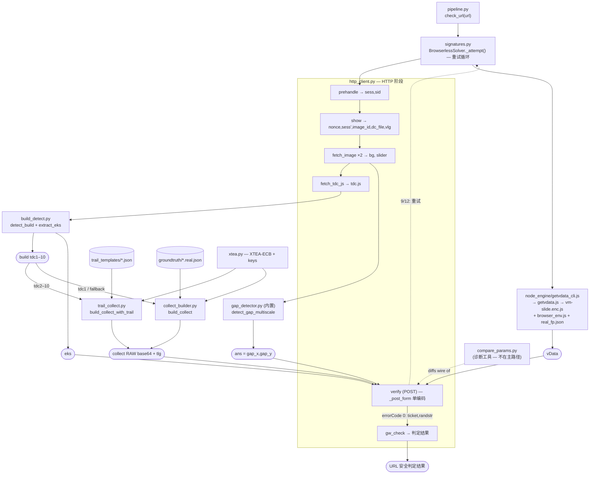
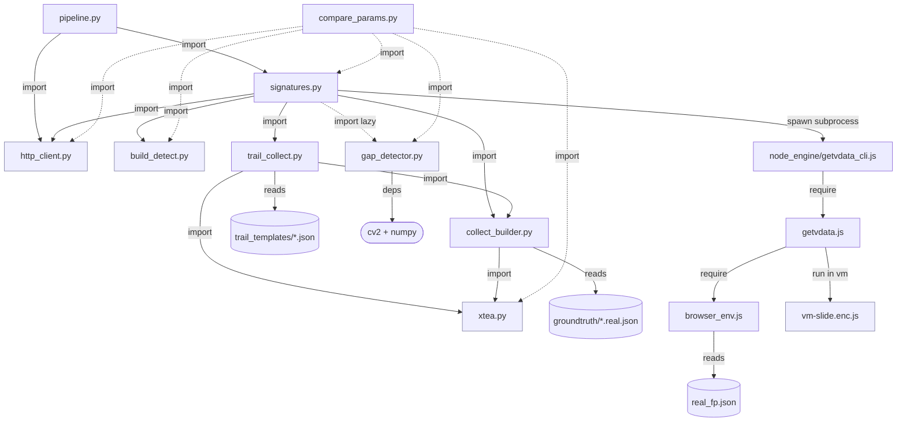

# browserless_pipeline — 完整的 urlsec.qq.com URL 安全检测链路

一个 orchestrator，负责运行针对 URL 的完整 urlsec.qq.com 检测流程，并返回安全判定结果：

```
prehandle → show (nonce/sess/image/tdc.js) → hycdn 图片 → CV 答案
          → tdc.js build-detect → collect (XTEA) → verify → gw_check → 判定结果
```

```bash
python3 -m browserless_pipeline.pipeline <url> [--provider browser|browserless]
# 例如
python3 -m browserless_pipeline.pipeline 4444.vip --provider browser
```

```python
from browserless_pipeline import check_url
verdict = check_url("4444.vip", provider="browser")
```

## 独立运行 — 随处打包部署

本文件夹是**自包含**的：把它放到你的代码旁边，直接 `import` 即可运行。它
不依赖外部仓库（CV 检测器和 collect 模板都已内置在 `gap_detector.py` / `groundtruth/` 中）。

```bash
# 1. 安装依赖
pip install -r browserless_pipeline/requirements.txt   # opencv-python-headless, numpy
#    另外需要 Node.js 在 PATH 中（用于 node_engine/getvdata_cli.js —— vData VM）

# 2. 运行（browserless 模式不需要 Chrome）
python3 -m browserless_pipeline.pipeline huawei.com --provider browserless
```

要部署到别处：执行 `tar -czf bl.tgz --exclude=__pycache__ browserless_pipeline`，
在目标环境解压，再 `pip install -r .../requirements.txt` 即可。`browser` 模式
额外需要 Kimi WebBridge 守护进程 + Chrome；`browserless` 模式不需要。

已验证：复制到空目录、无相邻仓库 → 自测通过（HAR/tdc.js 固定测试会优雅跳过），
且对 `huawei.com` 的实时检测返回 `eviltype 0 安全`。

## 架构 — 文件 ↔ 流程

URL 在代码中如何流转（browserless 路径）。每个方框标明拥有该步骤的文件/函数；
四种验证码签名在中间层生成，并在 `verify` 处合并。

```
 check_url(url)                                                        pipeline.py
      │
      ▼
 BrowserlessSolver.solve → _attempt()  (重试循环直到 errorCode 0)      signatures.py
      │
      ├─►(1) prehandle ─────────────────────► sess, sid               http_client.py
      ├─►(2) show ──────────► nonce, sess', image_id, dc_file, vlg     http_client.py
      ├─►(3) fetch_image ×2 ─► bg + slider PNG bytes                   http_client.py
      ├─►(4) detect_gap_multiscale(bg,sl) ─► gap_x,gap_y,conf  ══╗     gap_detector.py (内置)
      ├─►(5) fetch_tdc_js ─► tdc.js                              ║     http_client.py
      │        │                                                 ║
      │        ├─ detect_build ─► build (tdc1–10)                ║     build_detect.py
      │        └─ extract_eks  ─► eks ═══════════════════════╗   ║     build_detect.py
      │                                                      ║   ║
      ├─►(6) collect ─┐  trail template exists? (tdc2–10)    ║   ║
      │       ┌───────┴──── yes ─► trail_collect.build_collect_with_trail
      │       │                       └─ trail_templates/<build>.json + xtea.py
      │       └──────────── no (tdc1) ─► collect_builder.build_collect
      │                               └─ groundtruth/<build>.real.json + xtea.py
      │                        collect (RAW base64), tlg, ans ═╗ ║   ║
      │                                                        ║ ║   ║
      ├─►(7) vData  ── subprocess ─► node_engine/getvdata_cli.js
      │            getvdata.js → vm-slide.enc.js (Chaos VM)    ║ ║   ║
      │            + browser_env.js + real_fp.json             ║ ║   ║
      │                                    vData ══════════════╣ ║   ║
      │                                                        ▼ ▼   ▼
      └─►(8) verify(POST cap_union_new_verify) ◄── {ans, collect+tlg, eks, vData, vlg}
               _post_form() = 对数据包做一次 URL-encode                  http_client.py
                    │
                    ▼  errorCode 0 → ticket, randstr   (9/12 → 从第 1 步重试)
 ───────────────────────────────────────────────────────────────────
 gw_check(url, ticket, randstr) ─► VERDICT dict (eviltype, wording…)  http_client.py
```



### 模块依赖图（谁 import / 调用谁）

上面的数据流是**运行时发生了什么**；这张图说明**哪些文件依赖哪些文件**。
实线 = Python `import`；`reads` = 读取数据文件；`spawns` = 启动 Node 子进程。

```
                         pipeline.py            (入口 / CLI)
                          │  imports
                  ┌───────┴───────┐
                  ▼               ▼
            signatures.py      http_client.py   (仅 stdlib — 无内部依赖)
                  │ imports
   ┌──────┬───────┼───────────┬──────────────┐
   ▼      ▼       ▼           ▼              ▼ (lazy)
http_   build_  collect_    trail_         gap_detector.py
client  detect  builder ◄── collect         (cv2, numpy)
.py     .py     .py    imports  .py
                  │              │
                  │ imports      │ imports
                  └──────┬───────┘
                         ▼
                       xtea.py        (加密 + 10 把密钥 — 叶子节点)

  signatures.py ── spawns ─► node_engine/getvdata_cli.js
                                  │ require
                                  ▼
                              getvdata.js ── require ─► browser_env.js ─ reads ─► real_fp.json
                                  │ runs (vm context)
                                  ▼
                              vm-slide.enc.js   (真正的 Chaos VM)

  Data reads:  collect_builder.py ─reads─► groundtruth/<build>.real.json
               trail_collect.py   ─reads─► trail_templates/<build>.json

  Off-path:    compare_params.py ─imports─► signatures, http_client, build_detect,
                                            xtea, gap_detector   (仅诊断用途)
```



## 状态：FULLY BROWSERLESS `errorCode:0` — 端到端通过（2026-06-09）

browserless 路径现已达到 `errorCode:0`，并成功兑换真实 ticket：
`pipeline 4444.vip --provider browserless` → `eviltype 8101001 （该网站含有欺诈信息 /
违规欺诈）`，与 browser 路径结果一致 —— **无需 Chrome/WebBridge**。

最后一个阻塞点并非指纹真实性或风险评分（此前误判）—— 而是**我们自身数据包的
双重编码 bug**：`collect` 在 builder 中先被 url-quote，然后又在 `_post_form` 中
被 urlencode，导致服务器（只解码一次）看到 `%2F…` → base64 无效 → 滑轨无法读取
→ `errorCode 12/9`。修复方案：builder 返回 RAW base64（仅由 `_post_form` 做一次
线编码），并通过 `tlg = len(raw)` 与 HAR 对齐。该问题通过 `compare_params.py` 对
两条路径真实 verify 数据包做 diff 发现。现在该路径的唯一门槛只剩 CV gap 质量，
与 browser 路径一致。

`eks` 和 `vData` —— 两大加密阻塞点 —— 也**已解决**。每个 verify 字段都在无浏览器
的情况下生成，且服务器**接受并通过**：

| 阶段 | 是否 browserless | 所在文件 |
|---|:---:|---|
| prehandle / show / nonce / image-id / sess-upgrade | ✅ HTTP | `http_client.py` |
| `ans`（缺口） | ✅ CV | `gap_detector.py (内置)`（ans.x == gap_x，已验证） |
| build 识别（tdc1–10 中哪一个） | ✅ | `build_detect.py` |
| `collect` + `tlg` | ✅ XTEA | `xtea.py` + `collect_builder.py` |
| **`eks`** | ✅ **已解决** | `build_detect.extract_eks()` —— 它是服务端写入 tdc.js 的种子 `window[TDC_NAME]`，原样回传即可（与 HAR 字节级一致，352 字符）。无需计算。 |
| **`vData`** | ✅ **已解决** | `node_engine/getvdata_cli.js` —— 在 Node 中无头运行真正的 vm-slide Chaos VM（驱动：VM 的 `proxyXHR` export 注入 `&vData=`）。152 字符自定义 base64，构造正确。 |
| verify POST / `gw_check` | ✅ HTTP | `http_client.py` |

### eks / vData 是如何破解的
- **eks**：根本不是一个算法。在 `tcaptcha-slide.js` 中，`eks = E.getEks() =
  getInfo().info = window[TDC_NAME]`，而 `window[TDC_NAME]` 是服务端针对每个会话
  写入 tdc.js 的字面量。所以：拉取实时 tdc.js，用正则取出种子。无需 VM。
- **vData**：vm-slide Chaos VM 在加载时**不会**暴露 `window.getVData`（那是 IE
  遗留兼容）。真正的驱动是它的 **`proxyXHR`** export：调用它会 patch
  `XMLHttpRequest.prototype.send`，当向 `/cap_union_new_verify` 发起 POST 时，
  VM 会执行 `getCaptchaData → encryptData → custom-base64` 并追加 `&vData=...`。
  我们在 `node_engine/browser_env.js` 下无头运行真正的 VM，并读取注入的值。
  vData 本身按设计是非确定性的（每次调用都会把 `Math.random` 密钥烘焙进去）。

### 曾经的 `errorCode:0` 缺口 —— 已关闭（实为双重编码）
此前曾认为是行为/指纹风险缺口。实际上是我们自身 pipeline 的 bug：`collect` 在
线上被 URL 编码了两次（builder 的 `quote()` + `_post_form` 的 `urlencode`），
导致服务器（只解码一次）收到 `%2F…` → base64 无效 → 滑轨无法读取 → `errorCode 12`
（或 CV 弱时 `errorCode 9`）。修复方案：collect builder 返回 RAW base64，`tlg =
len(raw)`；单次线编码交给 `_post_form`。已通过对两条路径真实 verify 数据包做 diff
验证（`compare_params.py`）。browserless 路径现在通过（`errorCode:0`），唯一门槛
就是 CV gap 质量 —— 与 browser 路径完全一致。

### Solver

- **`browser`**（`BrowserEngineSolver`）—— **目前已端到端可用。** 通过 Kimi WebBridge
  (`:10086`) 驱动真实 Chrome；CV 缺口 + 模拟拖拽；页面自身引擎生成
  `collect`/`eks`/`vData`/`ans`，其 verify 返回 ticket。需要 WebBridge 守护进程 +
  Chrome。已验证：`4444.vip → eviltype 8101001 （该网站含有欺诈信息 / 违规欺诈）`。
- **`browserless`**（`BrowserlessSolver`）—— **完全无浏览器，无需 Chrome/WebBridge。**
  自己生成全部四个签名（CV ans + XTEA collect + 提取的 eks + 真实无头 VM vData）
  并 POST verify，带重试。**已达到 `errorCode:0` 并返回真实 ticket**（已验证：
  `4444.vip → eviltype 8101001`）。唯一门槛是 CV gap 质量（gap 弱 → `errorCode 9`，
  然后重试）。

## 文件地图 — 每个文件做什么

```
browserless_pipeline/
├── __init__.py            包入口 — 导出 check_url()
├── pipeline.py            orchestrator + CLI：解验证码 → gw_check → 判定结果
├── signatures.py          两个 solver（browserless / browser）
├── http_client.py         纯 HTTP 腾讯客户端（所有 HTTP 阶段）
├── build_detect.py        识别当前下发的 build（tdc1–10）+ 提取 eks
├── collect_builder.py     基于 groundtruth 模板构建 `collect`（tdc1 / fallback）
├── trail_collect.py       基于真实滑轨重定向到缺口位置来构建 `collect`（tdc2–10）
├── gap_detector.py        CV 滑块缺口检测 → ans（内置、自包含）
├── xtea.py                XTEA-ECB 加密 + 10 套 per-build 密钥
├── compare_params.py      诊断：对比 browserless vs browser 的真实 verify 数据包
├── requirements.txt       Python 依赖（opencv-python-headless, numpy）
├── README.md              本文件
├── README.zh-CN.md        中文版 README
├── trail_templates/       真实服务端通过的滑轨，每个 build 一个 JSON
│   └── tdc2.json … tdc10.json     （tdc1 没有 → 使用 collect_builder）
├── groundtruth/           内置的 collect 模板 + 自测 fixture
│   ├── tdc1.real.json … tdc10.real.json   collect_builder 使用的解析后 {cd,sd}
│   └── real_token_tdc2.txt                xtea 字节级自测的 fixture
└── node_engine/           vData 生成器（一个 Node 子进程）
    ├── getvdata_cli.js     stdin/stdout 桥：Python ↔ VM，输出 {vData}
    ├── getvdata.js         在 Node vm context 中加载并运行 Chaos VM
    ├── browser_env.js      Node 端浏览器 shim（window/document/canvas/WebGL）
    ├── vm-slide.enc.js     真正混淆后的腾讯 "Chaos VM"（生成 vData）
    └── real_fp.json        喂给 shim 的真实捕获设备指纹
```

### Python — 运行时
| 文件 | 作用 | 自测 |
|---|---|---|
| `__init__.py` | 包入口：`from browserless_pipeline import check_url` | — |
| `pipeline.py` | orchestrator + CLI。`check_url(url, provider)` = `solver.solve(url)` → `http.gw_check(...)` → 判定 dict | 真实端到端 |
| `signatures.py` | `CaptchaSolver` ABC + `BrowserlessSolver`（纯 HTTP+CV+加密）和 `BrowserEngineSolver`（通过 WebBridge 使用真实 Chrome）。一次 `_attempt()` 跑完整个验证码交互并返回 ticket | — |
| `http_client.py` | 仅 stdlib 的腾讯客户端（支持 gzip）：`prehandle / show / fetch_image / fetch_tdc_js / verify / gw_check`。`_post_form` 对数据包做一次 URL-encode | `python3 -m browserless_pipeline.http_client`（若存在 `../urlsec.qq.com.har` 则解析，否则跳过） |
| `build_detect.py` | 识别实时 tdc.js 属于 `tdc1–10` 中的哪一个（→ XTEA key），以及 `extract_eks()`（正则提取 `window[TDC_NAME]` 服务端种子） | `python3 -m browserless_pipeline.build_detect`（若仓库中有 `tdc*.js` 则使用，否则跳过） |
| `collect_builder.py` | 基于 `groundtruth/` 中的 `{cd,sd}` 模板 + XTEA 重建 `collect`。**tdc1** 及无 trail 模板时的 fallback | `python3 -m browserless_pipeline.collect_builder`（10/10 往返） |
| `trail_collect.py` | **tdc2–10** 的主要 `collect` builder：取一条真实通过的滑轨，缩放到 CV 缺口位置（`Σ type-1 dx ≈ 2.10·ans`），再 XTEA 加密。返回 RAW base64 + `tlg` + `ans` | `python3 -m browserless_pipeline.trail_collect` |
| `gap_detector.py` | CV 缺口检测：`detect_gap_multiscale(bg, slider)` → `(gap_x, gap_y, conf)`，基于边缘模板匹配。生成 `ans`。内置以保证包自包含（硬依赖：`cv2`、`numpy`） | `python3 browserless_pipeline/gap_detector.py <bg> <slider>` |
| `xtea.py` | XTEA-ECB（32 轮、delta `0x9E3779B9`、小端、零填充、base64）+ 10 套 per-build `KEYS` | `python3 -m browserless_pipeline.xtea`（与真实 token 字节级一致） |

### Python — 工具类（不在主检测路径上）
| 文件 | 作用 | 运行方式 |
|---|---|---|
| `compare_params.py` | 捕获两条路径的真实 verify 数据包，按字段 diff + 解密后的 `collect` 深度 diff。就是发现双重编码 bug 的工具 | `python3 -m browserless_pipeline.compare_params [url]`（线上运行；browser 侧需要 WebBridge） |

### Node 引擎 — vData 生成器（`node_engine/`）
| 文件 | 作用 |
|---|---|
| `getvdata_cli.js` | 被 `signatures.py` 以子进程调用；从 stdin 读取 `{paramString, captchaConfig,…}`，stdout 打印 `{vData}` |
| `getvdata.js` | `createSession()` —— 将 `vm-slide.enc.js` 加载到 Node `vm` context（带浏览器 shim），并驱动 VM 的 `proxyXHR` 生成 `vData` |
| `browser_env.js` | `install()` —— 提供最小化的 `window`/`document`/`canvas`/`WebGL`/`crypto`，让 VM 在无头环境下运行；加载 `real_fp.json` |
| `vm-slide.enc.js` | 真正的腾讯 Chaos VM（`__TENCENT_CHAOS_VM(...)`）—— 未修改；真实的 `vData` 算法 |
| `real_fp.json` | 真实捕获的设备指纹（canvas/WebGL 等），由 shim 提供给 VM（非 stub） |

### 数据
| 路径 | 作用 |
|---|---|
| `trail_templates/tdc2.json … tdc10.json` | 每个 build 一条真实服务端通过的滑轨（含其成功时的 `ans`），由 `trail_collect` 重定向。**tdc1 没有** → 使用 `collect_builder` |
| `groundtruth/tdc1.real.json … tdc10.real.json` | 解析后的 `{cd,sd}` collect 模板，由 `collect_builder` 加载（已内置，原外部依赖） |
| `groundtruth/real_token_tdc2.txt` | 真实捕获的 token；`xtea.py` 字节级自测的 fixture |

## 保真度说明（在信任 `collect` 前请先阅读）

- groundtruth（`groundtruth/*.real.json`）是真实通过解的解析后 `{cd, sd}`。
  `collect_builder` 输出紧凑 JSON —— 结构上保真，**不保证** 与 VM 精确空白填充的
  序列化字节级一致。（服务端已接受且滑块通过，因此实践中不是阻塞点。）
- `collect` 中的设备指纹是**从捕获机器借用的模板**，而非根据调用方环境生成。服务端
  已接受且滑块通过（`errorCode:0`）—— 因此模板指纹 + 重定向滑轨已足够；指纹真实性
  并非阻塞点。
- **线编码（重要）：** `collect` 必须以 RAW base64 上线 —— 单次 URL-encode 由
  `http_client._post_form`（`urlencode`）完成。请勿在 builder 中预先 `quote()`（会
  导致双重编码；服务端解码一次后 XTEA 失败）。`tlg = len(raw base64)`。
- 观察：该 `aid` 的 `show` 响应返回稳定的 `nonce`（`eda1152f11f1daf0`），跨会话不变
  —— 可能是缓存/模板产物；此处无害（我们原样回显实时 show 返回的内容）。

## `errorCode:0` — 完成（所谓“非 CV 阻塞点”其实是双重编码）

现在所有环节都在无浏览器环境下通过服务端校验：eks ✅、vData ✅、collect-cipher ✅、
collect-wire-encoding ✅、slide judgement ✅ → `errorCode:0`。

此前“非 CV 阻塞点”的结论（基于约 60 次线上 9/12 尝试）属于误诊。真正原因是 `collect`
在数据包上被**双重 URL 编码**（builder 的 `quote()` + `_post_form` 的 `urlencode`）；
服务端解码一次 → `%2F…` → base64 无效 → 滑轨无法读取 → `errorCode 12/9`。通过对比两条
路径真实 verify 数据包（`compare_params.py`）及 HAR（`collect` 为 raw base64，
`tlg == len(collect)`）定位并证明。修复后，模板指纹 + 重定向滑轨即可通过 —— 因此既
不需要指纹真实，也不需要 freshly-synthesized 滑轨。

来自真实数据的校准（15 次通过）：**ans.x == CV gap_x**；type-1 dx 总和 ≈ **2.10 × ans**
（设备缩放 `coordinate[2]`=2.0912），在 `trail_collect.py` 中实现。

唯一剩余波动：**CV gap 质量** —— gap 弱时仍会得到 `errorCode 9`，与 browser 路径一致，
solver 会重试。

> `--provider browserless` 和 `--provider browser` 现在都能达到 `errorCode:0`。

> 仅用于授权的安全研究。
